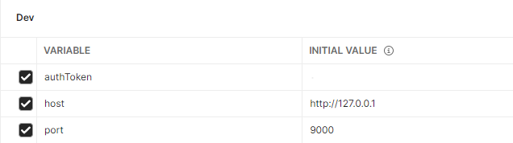

# Backend application for Expenses Tracker

## Development server

Run `npm run dev` for a dev server. The app will automatically reload if you change any of the source files in `./src` directory.

Application requires instance of MongoDB running localy on port 27017.

## Running with docker

Requires Docker instaled on local machine
Simply run `docker-compose up` and application will be accessible on 9000 port.

## Accessing with Postman

Import `misc\Expenses tracker.postman_collection.json` into your standalone Postman application ( ver 8+ preffered) and set Environment variables

Every call to login or user creation will set Auth token automaticaly in Postman for future requests
